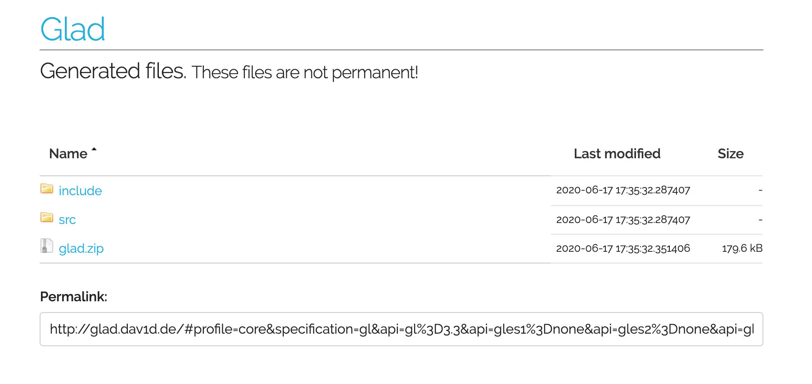

# OpenGl_Tutorial

## OpenGL 基本概念

## OpenGL 坐标系

## OpenGL 渲染过程

## OpenGL环境搭建

1. 安装GLEW和GLFW库

```
brew install glew
brew install glfw3
```

2. 打开GLAD的在线服务：[http://glad.dav1d.de](http://glad.dav1d.de)

生成对应的源文件和头文件:



将两个头文件目录glad和KHR复制到/usr/local/include文件夹中

3. 创建项目


4. 删除下面无用文件

```
AppDelegate.h
AppDelegate.m
ViewController.h
ViewController.m
main.h
```

5. 添加头文件

在Build Setting 的 Header Search Paths中添加

```
"/usr/local/include"
"$(inherited)"
"/usr/local/Cellar/glfw/3.2.1/lib"
"/usr/local/Cellar/glew/2.2.0/lib"
```


6. 添加依赖库


其中libglfw和libGLEW动态库是位于/usr/local/lib

7. 添加glad.c文件到项目中
8. 新建main.cpp文件，使用下面代码进行测试环境是否搭建成功：

```
#include <stdio.h>
#include <iostream>
#include <glad/glad.h>
#include <GLFW/glfw3.h>

int main(int argc, char **argv){
    using std::cout;    using std::endl;
    glfwInit();
    //主版本
    glfwWindowHint(GLFW_CONTEXT_VERSION_MAJOR, 3);
    //次版本
    glfwWindowHint(GLFW_CONTEXT_VERSION_MINOR, 3);
    //告诉glfw我们使用的是core_profile 核心模块
    glfwWindowHint(GLFW_OPENGL_PROFILE, GLFW_OPENGL_CORE_PROFILE);
    //向前兼容
    glfwWindowHint(GLFW_OPENGL_FORWARD_COMPAT, GL_TRUE);
    //创建一个GLFW窗口宽,高,窗口名字
    GLFWwindow* window = glfwCreateWindow(800, 600, "LearnOpenGL", NULL, NULL);
    if (window == NULL) {
        std::cout << "Failed to create GLFW window" << std::endl;
        glfwTerminate();
        return -1;
    }
    
    //通知GLFW将我们窗口的上下文设置为当前线程的主上下文了
    glfwMakeContextCurrent(window);
    
    //GLAD 是用来管理openGL 的函数指针的。所以在调用任何openGL函数之前我们都需要初始化GLAD。
    //我们给GLAD传入了用来加载系统相关的OpenGL函数指针地址的函数。GLFW给我们的是glfwGetProcAddress，它根据我们编译的系统定义了正确的函数。
    if (!gladLoadGLLoader((GLADloadproc)glfwGetProcAddress)) {
        std::cout << "Failed to initialize GLAD" << std::endl;
        return -1;
    }
    //创建渲染的视口: 我们必须要告诉OpenGl 需要渲染的尺寸大小，即为视口 viewport(),这样openGL 才能知道根据窗口大小显示数据和坐标。
    //glViewport 前两个参数控制视口左下角位置，后两个参数控制视口的宽和高
    //openGL 幕后使用的是glViewport 定义的 位置和宽高进行2D转换
    glViewport(0, 0, 800, 600);
    //窗口调整的时候 视口应该也被调整  对窗口注册一个回调函数每次窗口大小被调整的时候会被调用
    void framebuffer_size_callback(GLFWwindow *window, int width, int height);
    
    //通过 glfwSetFramebufferSizeCallback glfw 函数 当窗口frame 变化时会调用。
    //对于视网膜屏Retain屏宽度和高度明显比原输入值更高一点。
    glfwSetFramebufferSizeCallback(window, framebuffer_size_callback);
    
    void processInput(GLFWwindow *window);
    
    //为了防止 渲染的图像一出现就退出 我们使用while 循环 。我们可以称之为Render Loop
    //glfwWindowShouldClose 每次循环开始前检查一次GLFW 是否被要求退出 是true 的话渲染便结束了。
    while(!glfwWindowShouldClose(window)) {
        //输出控制
        processInput(window);
        //glfwSwapBuffers 会交换颜色缓冲（他是存储着GLFW 窗口每一个像素色值的大缓冲），将会作为输出显示在屏幕上
        //当程序退出的时候 使用一个自定义的颜色清空屏幕  在每个新的渲染迭代可是的时候我们总希望清屏否则总是看到上次渲染的结果。
        //我们可以使用glClear   GL_COLOR_BUFFER_BIT，GL_DEPTH_BUFFER_BIT和GL_STENCIL_BUFFER_BIT。 我们清空颜色 。
        glClearColor(0.5f, 0.1f, 0.0f, 1.0f);
        glClear(GL_COLOR_BUFFER_BIT);
        glfwSwapBuffers(window);
        //glfwPollEvents 检查函数有没有触发什么事件 键盘输入 鼠标移动 并调用对应函数
        glfwPollEvents();
    }
    glfwTerminate();
    return 0;
}

void framebuffer_size_callback(GLFWwindow* window, int width, int height) {
    glViewport(0, 0, width, height);
}

void processInput(GLFWwindow *window) {
    if(glfwGetKey(window, GLFW_KEY_ESCAPE) == GLFW_PRESS)
        glfwSetWindowShouldClose(window, true);
}
```

如果大家用的是Xcode11这时候可能发现项目可以跑起来了但是运行的时候会报错：

```
dyld: Library not loaded: /usr/local/opt/glfw/lib/libglfw.3.dylib
Referenced from: /Users/xxx/Library/Developer/Xcode/DerivedData/exp-dbtmjsotutirjzgmjxwevbhnprqp/Build/Products/Debug/exp
Reason: no suitable image found. Did find:
/usr/local/opt/glfw/lib/libglfw.3.dylib: code signature in (/usr/local/opt/glfw/lib/libglfw.3.dylib) not valid for use in process using Library Validation: mapped file has no cdhash, completely unsigned? Code has to be at least ad-hoc signed.
/usr/local/Cellar/glfw/3.3/lib/libglfw.3.3.dylib: code signature in (/usr/local/Cellar/glfw/3.3/lib/libglfw.3.3.dylib) not valid for use in process using Library Validation: mapped file has no cdhash, completely unsigned? Code has to be at least ad-hoc signed.
```

如果遇到这种错误大家可以在项目设置中的****Signing & Capabilities****把Headened Runtime 删掉

这里可能大家有许多还是不熟悉，很正常代码部分后面会和大家一起学习，这里先预先给大家介绍下上面提到的一些关键名词：

* glew: [The OpenGL Extension Wrangler Library](http://glew.sourceforge.net/)
不同的显卡公司，会发布一些只有自家显卡才支持的扩展函数，要想用这些函数，不得不去寻找最新的glext.h,有了GLEW扩展库，就再也不用为找不到函数的接口而烦恼，因为GLEW能自动识别你的平台所支持的全部OpenGL高级扩展函数。glew包含了OpenGL所需的核心

* glfw: [glfw.org](glfw.org) 
glfw是用来管理窗口，读取输入，处理事件等任务的开源库，OpenGL只是一套控制GPU的规则，并没有对于跨平台窗口显示和事件进行规定，所以需要一个显示显卡渲染的窗口，这就是glfw的作用。

* [GLAD:](https://www.khronos.org/opengl/wiki/OpenGL_Loading_Library)
>An OpenGL Loading Library is a library that loads pointers to OpenGL functions at runtime, core as well as extensions. This is required to access functions from OpenGL versions above 1.1 on most platforms. Extension loading libraries also abstracts away the difference between the loading mechanisms on different platform


## 较好的内容推荐

* [Learn OpenGL CN](https://learnopengl-cn.github.io/)

